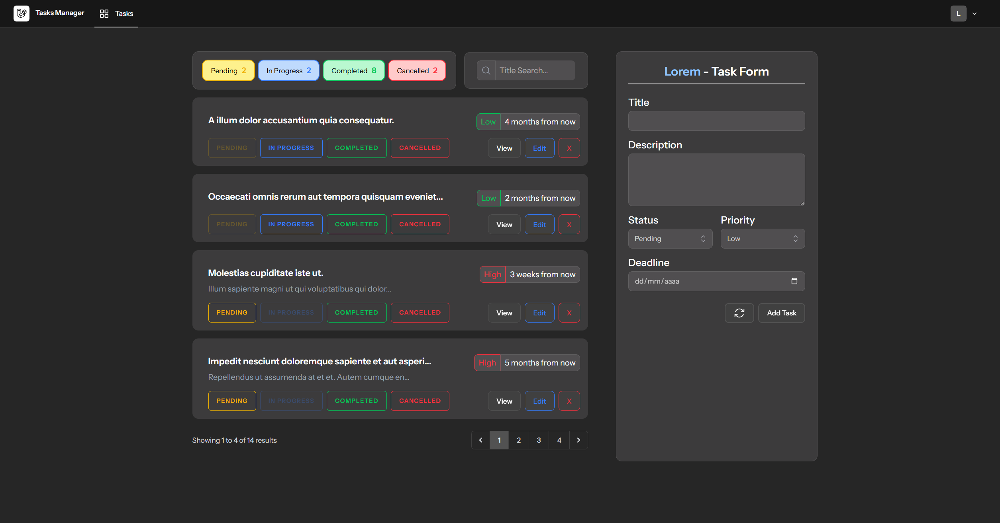
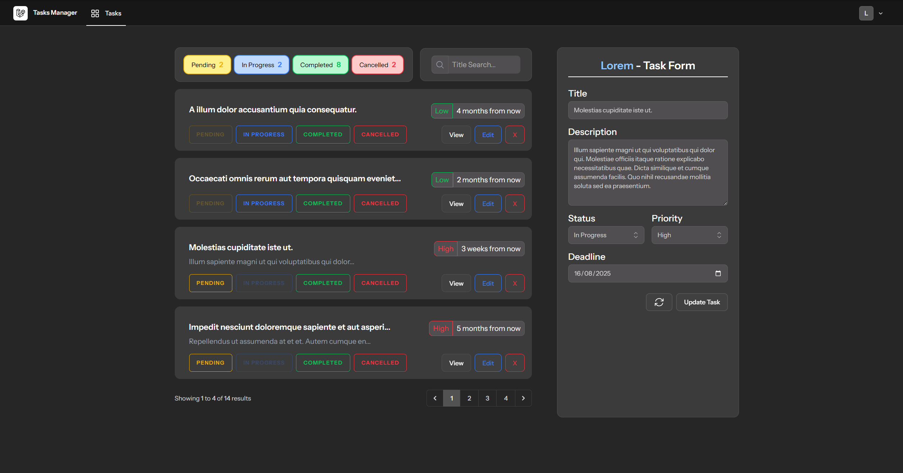
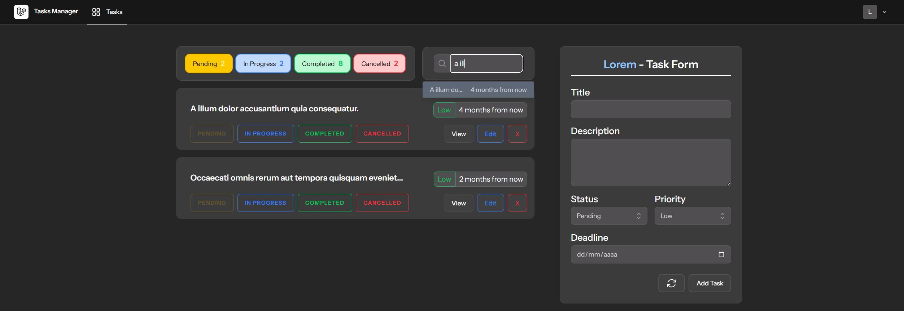
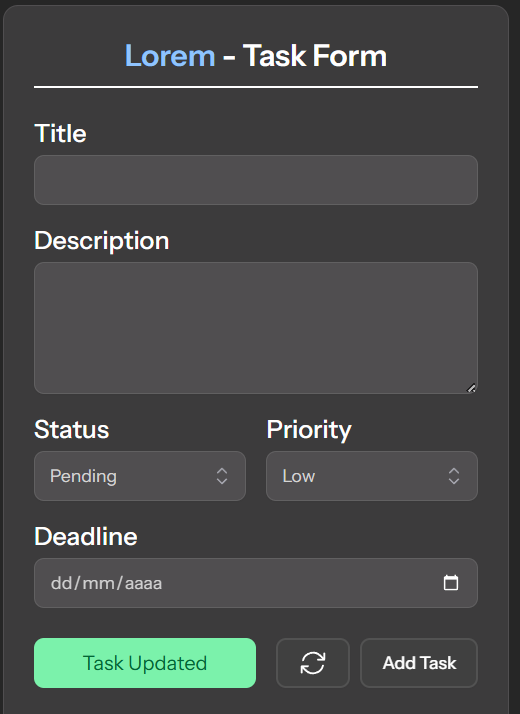
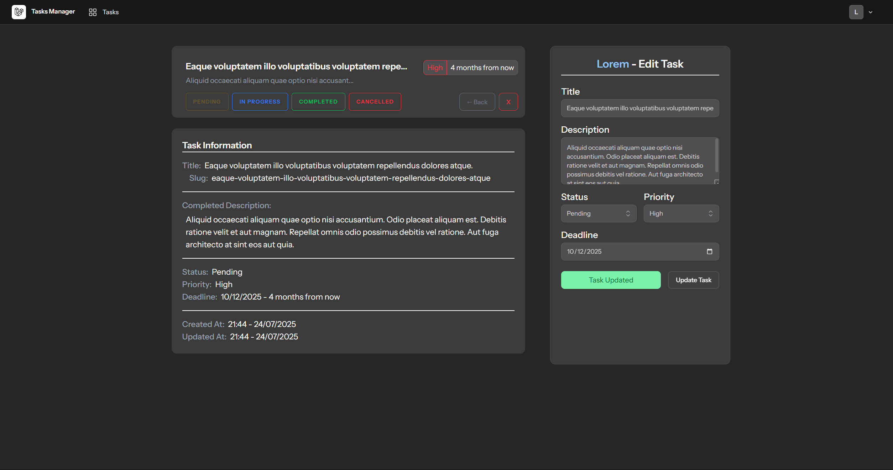

# Tasks Web

Esta es una web para gestionar Tasks usando Livewire.  
Las vistas están divididas en componentes reutilizables y las páginas funcionan con Livewire para no necesitar recargar.

Puedes registrarte / iniciar sesión para ver tus tareas.  
Un usuario registrado puede crear, editar, eliminar, etc...

## Main Page

La página principal tiene 2 columnas:
- Listado de Tareas del Usuario junto a los filtros
- Formulario para crear y editar

En el listado se ven los datos principales. Los títulos son enlaces utilizando Slug y los botones de Status son interactuables para cambiar el Status de cada tarea de manera rápida.

  

El botón de View muestra la Task en tamaño grande con todos los datos sin recortar en tamaño. El botón de Delete pide confirmación antes de eliminar.  
El botón de Edit cambia y rellena el formulario para poder editarlo rápidamente.

  

Los contadores superiores funcionan como botones interactivos para filtrar por Status.  
El widget de búsqueda muestra un listado filtrado con Title y Deadline que permite abrir la Task seleccionada.

  

Al crear/editar/eliminar se muestra un Flash Message junto al Form

 

## Show Page

Al ver una Task completa se muestra la misma Card de la Task encima de la información completa sin recortes.  
Además, el Form se reutiliza cambiando los valores necesarios para que solo sirva para editar.  
Los botones de Status y Delete siguen funcionando y aparece un nuevo botón Back.

